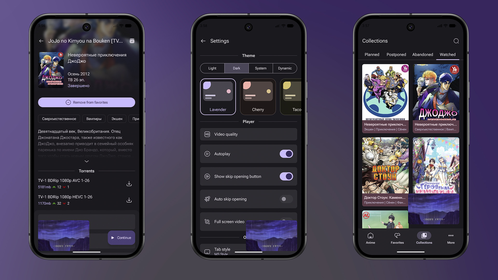

# LibertyFlow

### Неофициальный андроид клиент для [AniLiberty](https://anilibria.top/)

## Features
- Большой выбор тайтлов с озвучкой от AniLiberty.
- Хранение и отслеживание любымих тайтлов с помощью избранного.
- Разнообразные списки для сортировки.
- Кастомизация через разные цветовые схемы или динамические цвета.
- Удобный и красивый дизайн на Material 3 Expressive от Google.
- Удобный плеер с множеством разных фич.
- Расширенный поиск, возможность искать тайтлы по множеству параметров.
- Отсутствие какой-либо рекламы
- Английская версия приложения
## Main libraries
- [ViewModel](https://developer.android.com/topic/libraries/architecture/viewmodel)
- [Navigation](https://developer.android.com/guide/navigation)
- [Hilt](https://developer.android.com/training/dependency-injection/hilt-android)
- [Retrofit](https://square.github.io/retrofit/)
- [Jetpack Compose](https://developer.android.com/compose)
- [Coil](https://coil-kt.github.io/coil/compose/)
- [Room](https://developer.android.com/reference/androidx/room/package-summary)
- [Lottie](https://github.com/airbnb/lottie/blob/master/android-compose.md)
- [Paging](https://developer.android.com/jetpack/androidx/releases/paging)
- [Haze](https://chrisbanes.github.io/haze/latest/)
- [Material Design 3 Expressive](https://m3.material.io/)
## Some issues
- РКН очень любит блокировать аниме сервисы, поэтому некоторые данные могут не грузиться без впн
## App preview
https://github.com/user-attachments/assets/21770f8c-8362-49cb-ae59-26ceed772e56

